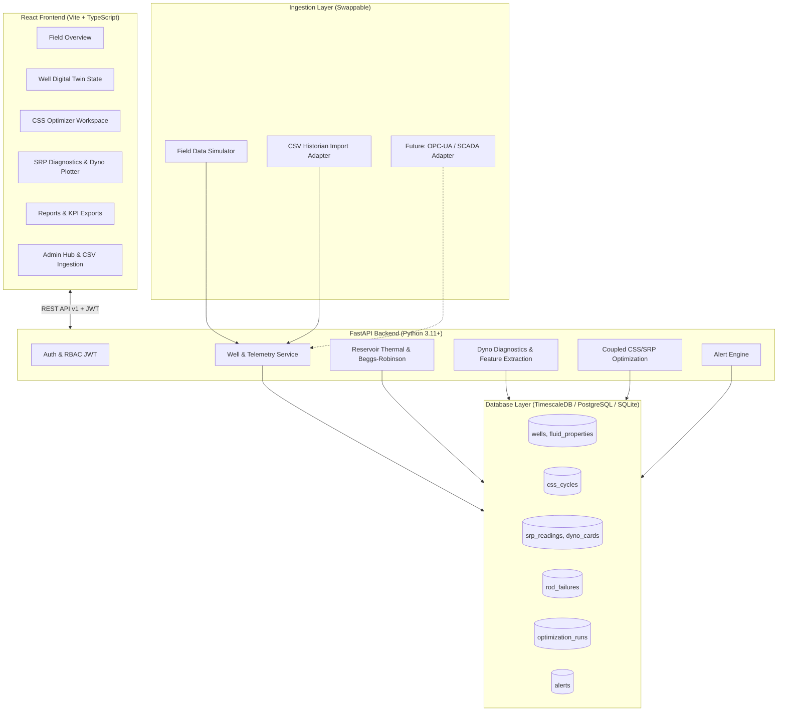

# WellSync 🛢️⚡
### AI-Enabled Well-to-Surface Digital Twin for CSS Cycle & Sucker Rod Pump Optimization
**Smart India Hackathon (SIH) Problem Statement ID:** 26120 | **Organization:** Oil India Limited (OIL) | **Category:** Software | **Theme:** Smart Automation  
**Target Field:** Baghewala, Rajasthan — Jodhpur Sandstone heavy oil (17–19° API, 46–48°C baseline reservoir temperature).

---

## 📌 Executive Summary

At Baghewala, cyclic steam stimulation (CSS) and sucker rod pump (SRP) lift settings have historically been tuned independently and reactively based on rules of thumb. As injected steam heat bleeds off after a cycle, crude viscosity climbs steeply, causing traveling valves to "float" through empty pump barrels (**fluid pound**). This leads to severe mechanical shock loads, premature rod string parting, pump-off downtime, and excessive steam-oil ratios (SOR).

**WellSync** bridges this operational silo through a **single, continuously-updated Digital Twin State per well** that couples:
1. **Physics-Grounded Reservoir Decline & Viscosity Model:** Calibrated exponential thermal decay coupled with the **Beggs-Robinson** dead-oil correlation for Jodhpur sandstone heavy crude.
2. **Surface Dynamometer Card Diagnostics (ML):** Engineered 5-feature vector (PPRL, MPRL, card area, downstroke load-derivative spike, counterbalance ratio) with an XGBoost/Gradient Boosting classifier detecting normal, fluid pound, gas interference, pump-off, and worn valves.
3. **Coupled Optimization Engine:** Recommends CSS parameters (steam volume, soak time) to minimize SOR while proactively projecting the required SRP setpoint (SPM, stroke length) under **API RP 11L dynamic rod stress limits**.
4. **Human-in-the-Loop Approval Gate:** Every setpoint change requires explicit engineering authorization before being logged as applied.
5. **Source-Agnostic Ingestion:** A swappable `IngestionSource` interface allows seamless switching between the built-in physically calibrated **Field Data Simulator** and real historian SCADA batch CSV imports.

---

## 🏗️ System Architecture



---

## 🚀 Quickstart Guide

### Option 1: Docker Compose (Recommended)

Run the entire stack with one command:
```bash
docker compose up --build
```
- **Frontend Dashboard:** [http://localhost:3000](http://localhost:3000) or [http://localhost:5173](http://localhost:5173)
- **FastAPI OpenAPI Swagger:** [http://localhost:8000/docs](http://localhost:8000/docs)
- **Health Check:** [http://localhost:8000/health](http://localhost:8000/health)

---

### Option 2: Local Development Setup

#### 1. Backend Setup (FastAPI)
```bash
# Navigate to backend and create a virtual environment
python -m venv .venv
source .venv/bin/activate  # On Windows: .venv\Scripts\activate

# Install dependencies
pip install -r backend/requirements.txt

# Seed demo wells and test accounts
python backend/seed.py

# Launch FastAPI development server
uvicorn app.main:app --reload --port 8000
```

#### 2. Frontend Setup (React + Vite)
```bash
# In a new terminal:
cd frontend
npm install
npm run dev
```
Open [http://localhost:5173](http://localhost:5173) in your browser.

---

## 👥 Demo Accounts (Pre-Seeded)

For evaluators and judges, the following roles are pre-configured:

| Role | Email | Password | Primary Workflow |
|---|---|---|---|
| **Field Engineer** | `field@wellsync.demo` | `wellsync123` | Monitored dyno cards, fluid pound response, SPM approval |
| **Reservoir Lead** | `reservoir@wellsync.demo` | `wellsync123` | CSS cycle parameter optimization, decline curve what-if |
| **Operations Manager** | `ops@wellsync.demo` | `wellsync123` | Field-wide SOR, energy cost per bbl, PDF/CSV report exports |
| **System Administrator** | `admin@wellsync.demo` | `wellsync123` | User provision, switching between Simulator & CSV Ingestion |

*Note: The login screen contains an **Instant Demo Account Switcher** allowing one-click login into any role.*

---

## ⏱️ 7-Minute Live Hackathon Demo Walkthrough

1. **Minute 0:00 — Login as Field Engineer:** Land on the **Field Overview** dashboard showing real-time SOR ($2.82 \text{ m}^3/\text{bbl}$) and lifting energy ($38.0 \text{ kWh/bbl}$). Observe the flashing critical alert on well **`BGW-003`**.
2. **Minute 0:30 — Inspect Well `BGW-003` Digital Twin:** Open the 3-panel Digital Twin display. See estimated reservoir temperature decaying to $52.3^\circ\text{C}$ and heavy oil viscosity rising to $1,840\text{ cP}$.
3. **Minute 1:15 — Dynamometer Surface Diagnostics:** Observe the dyno card plot showing the classic **"backward-C" downstroke collapse notch** diagnosed as **Fluid Pound (87% confidence)**.
4. **Minute 2:00 — API RP 11L SPM Optimization:** Review the system recommendation proposing an SPM cut from $6.8 \to 5.1\text{ SPM}$, improving pump fillage from $61\% \to 89\%$ while verifying rod stress remains within $32,000\text{ psi}$. Click **Approve & Apply** (Human-in-the-Loop gate).
5. **Minute 3:00 — Switch to Reservoir Lead (CSS Optimizer):** Navigate to well **`BGW-005`** (rich 5-cycle history). Adjust steam volume and soak time sliders. Observe candidate designs ranked by lowest SOR and expand the row to reveal the **coupled downstream SRP lift impact**.
6. **Minute 4:30 — Operations Manager Reporting:** Open the **Reports** workspace. Inspect the 90-day decline in field-wide lifting energy and download a branded operational PDF report.
7. **Minute 5:30 — Admin Ingestion Swap (Proof of Source Agnosticism):** Open the **Admin Hub**, select **CSV Batch Historian**, upload `sample_historian_export.csv`, and demonstrate the exact same pipeline consuming external SCADA exports with zero code changes.

---

## 🧪 Automated Test Suite

Run unit and integration tests covering physics models, ML classification, and API endpoints:
```bash
pytest
```
*Coverage includes:*
- Beggs-Robinson heavy-oil viscosity calculations against reference values
- Exponential reservoir thermal decline convergence
- Dynamometer card feature extraction (Shoelace polygon work, downstroke spike derivative)
- API RP 11L dynamic rod stress limits under randomized conditions
- Goodman diagram rod failure risk score monotonicity
- Full FastAPI endpoint authorization and human-approval gates

---

## 📜 Technology Stack

- **Backend:** Python 3.11+, FastAPI, SQLAlchemy, TimescaleDB / PostgreSQL, Scikit-learn, XGBoost, APScheduler, ReportLab.
- **Frontend:** React 18, TypeScript, Vite, TanStack Query, Zustand, Recharts, Lucide Icons.
- **Infrastructure:** Docker, Docker Compose, Nginx.
