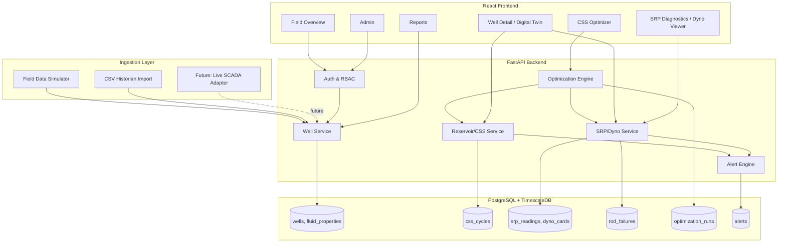

# 01 — Overview: WellSync
### AI-Enabled Well-to-Surface Digital Twin for CSS Cycle & Sucker Rod Pump Optimization
**SIH Problem Statement ID:** 26120 | **Organization:** Oil India Limited | **Category:** Software | **Theme:** Smart Automation
**Field:** Baghewala, Rajasthan — Jodhpur Sandstone heavy oil (17–19° API, 46–48°C reservoir temperature)

> **Note on evaluation criteria:** the problem statement text provided does not include an explicit deliverables/evaluation-weightage table (unlike some SIH PS documents). This blueprint is therefore designed against the standard strong-SIH-software criteria — working prototype, technical depth/architecture, innovation, and presentation/Q&A — and against the PS's own explicit "Expected Solution" and "Expected Benefits" bullets, which are treated as the de facto scoring rubric throughout this document. Re-confirm the official evaluation table on the SIH portal once published and adjust the demo weighting in §12 if it differs.

---

## 1. Product Vision

**Product name:** **WellSync** — the two halves of the problem (thermal reservoir/CSS cycle, and mechanical SRP lift) kept "in sync" through one shared digital-twin state per well.

**One-line pitch:** One live model per well that predicts how heat, viscosity and rod load change together — and tells the field engineer exactly what to set the steam volume, soak time and pump speed to, before the rod fails or the pump pounds.

**Elevator pitch:** At Baghewala, CSS steam cycles and sucker-rod-pump settings are tuned separately, by experience, using data that already exists but is never connected. As reservoir heat bleeds off after a steam cycle, crude viscosity climbs, pump efficiency drops, and rods start "floating" (fluid pound) — often discovered only after a rod fails. WellSync fuses reservoir thermal decline, viscosity behaviour, and live dynamometer-card diagnostics into a single per-well digital twin, continuously recommending (a) the CSS parameters (steam volume, soak time, cutoff) that minimize Steam-Oil Ratio for that well's decline profile, and (b) the SRP setpoints (SPM, stroke length, VFD frequency) that maximize pump fillage without exceeding rod-string stress limits — flagging rod-floating and elevated failure risk before it becomes a workover.

**Detailed product description:** WellSync is a role-based web application (FastAPI + PostgreSQL/TimescaleDB backend, React dashboard) built around a per-well **Digital Twin State**: a continuously updated model combining (1) a physics-grounded reservoir thermal-decay and viscosity model calibrated to each well's historical CSS cycles, (2) a dynamometer-card feature extractor and classifier that diagnoses pump condition (normal / fluid pound / gas interference / pump-off / worn valve) from surface card data, and (3) an optimization engine that proposes CSS and SRP setpoints and predicts their effect before anything is changed in the field. Because Oil India's live SCADA/historian feed is not available for the hackathon, WellSync ships with a **Field Data Simulator** that generates physically realistic time-series (steam cycles, dynamometer cards with injected rod-floating events, rod failures) matching Baghewala's stated parameters — and the identical ingestion/analytics pipeline consumes real historian CSV exports or a live feed with zero code change, which is the core architectural claim we make to judges.

**Core problem:** CSS and SRP operations are optimized independently and reactively, from experience, rather than jointly and predictively from the data OIL already collects.

**Our solution:** A shared, continuously-updated digital twin per well that couples the thermal/viscosity side (CSS) to the mechanical/lift side (SRP), so a recommendation on one always accounts for its effect on the other.

**Target users:** SIH evaluators (during the event); Oil India field/reservoir engineers and operations managers at Baghewala (the real end users this PS is written for).

**Secondary users:** Maintenance/workover planning engineers (rod-failure risk feed); production engineering managers (field-wide SOR/energy KPI reporting).

**Stakeholders:** Oil India Limited (problem owner), SIH organizing committee, the participating team, field operations staff who would use the recommendations day-to-day.

**Value proposition:** Turns data OIL already has (production history, CSS records, VFD/SRP logs, rod-failure history, PVT data) into a joint, explainable recommendation — not two separate spreadsheets and one engineer's intuition.

**Why this solution is better:** It explicitly couples the two subsystems the PS names as historically decoupled (CSS and SRP) through one shared state, rather than building two unrelated dashboards side-by-side and calling it a "digital twin."

**Why this solution can win SIH:** The PS rewards integration and predictive/data-driven decision-making, not a single flashy chart — a scoring approach that favors a team that can show, live, one changed CSS parameter propagating into a changed SRP recommendation (and the predicted SOR/energy impact of both), which is exactly what WellSync's shared-state architecture is built to demonstrate.

---

### Why We Win — Brutally Honest Analysis

**Strengths:**
- We build to the PS's own bullet list literally: CSS optimization, reservoir prediction, SRP optimization, rod-floating detection, pump efficiency, and steam/energy optimization each map to one explicit, demoable module — nothing is generic "AI dashboard" filler.
- We use real, named petroleum-engineering methods (Beggs-Robinson viscosity correlation, exponential thermal-decay/Marx-Langenheim-style cooling, API RP 11L rod-stress limits, dynamometer-card pattern diagnosis) instead of an unexplainable black box — this is what will hold up in the "Technical Discussion and Q&A" style evaluation any petroleum-domain judge will run.
- We explicitly design a **human-approval gate** before any recommendation is treated as "applied" — realistic for a safety-relevant field operation, and pre-empts the obvious judge objection "you're not really going to auto-drive a VFD, are you?"
- A synthetic-but-physically-calibrated Field Data Simulator, generated from the PS's own stated field parameters (17–19° API, 46–48°C reservoir temperature, Jodhpur Sandstone), removes our single biggest risk (no dataset link provided) without pretending the demo runs on real OIL data.

**Weaknesses we must address:**
- The Beggs-Robinson correlation and the exponential thermal-decay model are both simplifications of real reservoir thermodynamics (true CSS heat transfer is 2D/3D and non-uniform); we mitigate this by presenting them explicitly as *first-order, calibratable* models — each has free parameters fit per-well from historical cycle data — rather than claiming reservoir-simulator-grade physics, and we state this limitation proactively in the Technical Report rather than waiting for a judge to catch it.
- Dynamometer-card diagnosis from synthetic data risks not generalizing to real card shapes; we mitigate by making the classifier's features (card area, PPRL/MPRL, downstroke-derivative spike) individually inspectable and by shipping a clearly labeled "confidence" score with every diagnosis rather than a bare label.
- Rod-failure prediction from limited synthetic failure history is inherently a small-data problem; we frame it explicitly as a **risk score for prioritization**, not a certified failure-time prediction, to avoid overclaiming.
- No real SCADA integration exists — mitigated by designing the ingestion layer as a swappable adapter (`IngestionSource`, mirroring a decoupled-source pattern) so "connect to real OIL historian" is a stated, credible next step rather than an unaddressed gap.

---

## 2. SIH Winning Strategy

**What judges should remember:** "The only team whose CSS recommendation and SRP recommendation for the same well visibly moved together on screen — because they actually share one model, not two dashboards."

**Strongest differentiators:**
1. One shared per-well **Digital Twin State** coupling reservoir/CSS and SRP/mechanical sides, rather than two independent tools.
2. Named, explainable petroleum-engineering methods (Beggs-Robinson, API RP 11L rod stress, dynamometer-card diagnosis) instead of an opaque model.
3. A physically-calibrated synthetic Field Data Simulator standing in for the (unavailable) real historian feed, through a swappable ingestion interface.
4. A human-approval workflow for every recommendation — realistic for a safety-relevant industrial system, not an over-promised "fully autonomous" claim.

**Technical innovation:** Coupling a calibrated thermal/viscosity decline model to a live dynamometer-card SPM/pump-off control loop through one optimization objective (minimize SOR and energy-per-barrel jointly, subject to rod-stress and pump-fillage constraints) — most competing "digital twin" entries will likely model only one subsystem.

**Social/economic/government impact:** Directly targets the PS's stated benefits — higher recovery, lower SOR, lower energy cost per barrel, fewer rod failures/workovers — which are real cost centers for a public-sector heavy-oil operator; broadly applicable to OIL's other heavy-oil/CSS fields beyond Baghewala.

**Scalability:** Per-well digital twin state is independent and horizontally scalable (add wells without redesign); the `IngestionSource` abstraction generalizes from the bundled simulator to a CSV batch import to a live historian/OPC-UA feed without touching the analytics layer.

**Feasibility:** Every model is closed-form or a well-understood ML method (XGBoost, Bayesian/grid optimization) trainable on modest data — nothing requires GPU infrastructure or large labeled datasets.

**Competitive advantage:** Most teams will likely build either a CSS-only forecasting dashboard or an SRP-only anomaly detector; few will couple both into one recommendation loop, which is the PS's actual ask ("integrated, data-driven system that continuously optimizes both").

**Demo wow factors:** Live "what-if" slider on CSS soak time instantly re-computing not just predicted SOR but also the recommended SPM change for the resulting viscosity; a synthetic dynamometer card visibly showing the fluid-pound "backward-C" collapse, correctly classified live, with an SPM-reduction recommendation appearing immediately; a rod-failure risk leaderboard across the simulated well field.

**Metrics to showcase:** Predicted SOR reduction vs. historical baseline, energy-per-barrel reduction, dynamometer-card classification confidence/accuracy, rod-failure risk score trend, pump fillage % before/after recommendation.

**What makes this difficult to replicate quickly:** Calibrating the coupled thermal/viscosity/mechanical models consistently against one shared synthetic dataset (so the CSS and SRP sides are provably using the *same* underlying well state) is more work than building two independent toy models — most teams will not realize this coupling is the actual point of a "digital twin" until late.

**Why realistic, not over-engineered:** No live PLC/VFD control loop is actually closed (recommendations require human approval, per §"Weaknesses" above); no attempt to build a full 3D reservoir simulator — first-order calibrated models are used deliberately, matching what is feasible and explainable within a hackathon timeline.

---

## 3. User Personas

### Persona A — Field/Production Engineer
- **Role:** Monitors day-to-day well performance, dynamometer cards, and SRP settings at Baghewala.
- **Goals:** Catch rod-floating early, keep pumps efficient, avoid unplanned failures.
- **Problems:** Adjusts SPM/stroke manually and reactively, often only after a problem is already visible on production data.
- **Technical ability:** High operational/mechanical knowledge, moderate software fluency.
- **Current workflow:** Reviews dynamometer cards and production reports manually, adjusts VFD settings based on experience.
- **Pain points:** No early-warning signal before a rod failure or pump-off event; SPM changes made without a clear efficiency/risk trade-off.
- **How they interact:** Views the Well Detail / Digital Twin screen daily; responds to Alerts; approves or rejects SRP recommendations.
- **Most important features for them:** Dynamometer-card diagnosis with confidence, SPM/stroke recommendation with predicted impact, rod-failure risk alerts.

### Persona B — Reservoir Engineer
- **Role:** Designs CSS cycle parameters (steam volume, injection pressure, soak time, cutoff) for each well.
- **Goals:** Minimize SOR while maximizing cumulative oil recovery per cycle.
- **Problems:** Cycle design is based on historical practice per well, not a live decline forecast.
- **Technical ability:** High domain knowledge (thermal recovery, reservoir engineering), moderate software fluency.
- **Current workflow:** Reviews past cycle performance spreadsheets, sets next cycle's parameters by analogy to similar past cycles.
- **Pain points:** No forecast of how a candidate parameter change would actually affect this specific well's decline curve and SOR before committing steam.
- **How they interact:** Uses the CSS Optimizer screen to run "what-if" cycle simulations and review the model's recommended parameters before finalizing a cycle plan.
- **Most important features for them:** Reservoir thermal/production forecast chart, CSS parameter optimizer with predicted SOR/oil-recovery trade-off, per-well historical calibration transparency.

### Persona C — Operations Manager
- **Role:** Oversees field-wide production, cost (steam/energy), and reliability KPIs.
- **Goals:** Reduce field-wide SOR and energy cost per barrel; reduce rod-failure frequency; report on data-driven decision-making to leadership.
- **Problems:** No unified, field-wide view combining CSS efficiency and SRP reliability metrics.
- **Technical ability:** Moderate — reads dashboards and reports, not the underlying algorithms.
- **Current workflow:** Aggregates reports from multiple engineers/spreadsheets periodically.
- **Pain points:** Slow, manual roll-up of KPIs across wells; reactive rather than proactive maintenance/workover planning.
- **How they interact:** Uses the Field Overview dashboard and Reports screen; does not adjust individual well parameters.
- **Most important features for them:** Field-wide KPI dashboard (SOR, energy/bbl, rod-failure count trend), rod-failure risk leaderboard, exportable reports.

### Persona D — Maintenance/Workover Planning Engineer
- **Role:** Schedules workovers and rod replacement based on failure risk.
- **Goals:** Prioritize high-risk wells before failure, not after.
- **Problems:** Rod-failure history reviewed retrospectively, not used predictively.
- **Technical ability:** High mechanical/reliability domain knowledge.
- **How they interact:** Views the Rod-Failure Risk screen (sortable by risk score) to plan upcoming workovers.
- **Most important features for them:** Rod-failure risk score with contributing factors, historical failure log per well.

---

## 4. Complete User Journeys

### Journey 1 — Daily SRP Monitoring & Rod-Floating Response (Field Engineer)
```
Field Engineer logs in
→ Field Overview dashboard shows well list with status badges (Normal / Alert / Critical)
→ Engineer opens Well Detail for a well flagged "Alert"
→ Digital Twin State panel shows: current reservoir temp estimate, viscosity estimate, latest dynamometer card, pump fillage %, rod-failure risk score
→ Dynamometer Card Viewer shows the latest card classified as "Fluid Pound (Rod Floating)" with confidence 87%
→ SRP Recommendation panel shows: "Reduce SPM from 6.2 to 4.8; predicted fillage improves from 61% to 89%; rod stress reduced within API RP 11L limit"
→ Engineer clicks "Review Recommendation" → sees the predicted before/after dynamometer card shape and stress calculation
→ Engineer clicks "Approve" (human-in-the-loop — no automatic VFD write in this system's scope)
→ System logs the approved change; next simulated/ingested data reflects updated setpoint
```
**Failure paths:** dynamometer card data missing/corrupt for a cycle → card viewer shows explicit "No valid card this interval" rather than a stale or fabricated card; recommendation engine cannot converge (insufficient historical calibration data for a new well) → panel shows "Insufficient history — using field-average defaults" instead of a falsely confident number; engineer rejects a recommendation → system logs the rejection reason (optional free-text) for later model review, does not re-prompt repeatedly.

### Journey 2 — CSS Cycle Planning (Reservoir Engineer)
```
Reservoir Engineer opens CSS Optimizer for a well due for its next cycle
→ Reservoir/Production Forecast chart shows predicted oil-rate decline vs. days since last steam, calibrated to this well's history
→ Engineer adjusts candidate parameters (steam volume, soak time) on sliders
→ System recomputes predicted cumulative oil, steam used, resulting SOR, and — critically — the resulting viscosity-driven SRP setpoint change this cycle will require later
→ Engineer compares 2–3 candidate parameter sets side-by-side
→ Engineer selects and saves the chosen cycle plan
```
**Edge cases:** well has fewer than N historical cycles to calibrate from → optimizer falls back to field-level (multi-well) calibrated defaults, clearly labeled as such; extreme parameter combination outside historical range → warning that the forecast is an extrapolation with wider uncertainty, not a hard block (reservoir engineers must retain authority to try new parameters).

### Journey 3 — Field-Wide KPI Review (Operations Manager)
```
Manager opens Field Overview
→ Sees field-wide SOR trend, energy-per-barrel trend, rod-failure count trend (last 90 days vs. prior period)
→ Opens Rod-Failure Risk leaderboard, sorted by risk score
→ Exports a PDF/CSV report for a leadership review
```

### Journey 4 — Onboarding a New/Real Data Source (Technical Evaluation Q&A demo)
```
Operator opens Admin → Data Sources
→ Shows the currently active "Simulated Field Data" source
→ Demonstrates switching to "CSV Import" and uploading a sample historian-format export
→ Same Well Detail/Optimizer screens render identically, sourced from the new data — the concrete proof that the analytics layer is source-agnostic
```

---

## 5. Feature Specification

### P0 — Must Have
| Feature | Purpose | Backend Behavior | Validation | Success | Failure |
|---|---|---|---|---|---|
| Field Data Simulator | Stand in for unavailable live OIL data | Generates physically-calibrated synthetic time series (steam cycles, dynamometer cards, rod events) matching PS field parameters | Config bounded to realistic ranges (API 17–19, temp 46–48°C) | Continuous, labeled-as-synthetic data stream | Generator failure → clearly surfaced, not a silent data gap |
| Well & data model | Represent each well's full state | Stores wells, cycles, SRP readings, rod events, fluid properties | Schema-validated on ingest | Digital Twin State computable per well | Missing required field → ingestion rejected with reason, not partially stored |
| Reservoir thermal/viscosity forecast | Predict rate decline & viscosity through a cycle | Exponential thermal-decay model + Beggs-Robinson viscosity correlation, calibrated per well | Calibration requires ≥ N historical cycles else field-default fallback | Forecast chart renders with confidence band | Insufficient data → explicit fallback label, not a fabricated tight forecast |
| CSS parameter optimizer | Recommend steam volume/soak time/cutoff | Grid/Bayesian search over calibrated cycle-response model, objective = minimize SOR s.t. minimum recovery constraint | Candidate parameters bounded to physically sane ranges | Recommendation + predicted SOR/recovery shown | No feasible candidate found → reports why (constraint too tight) rather than silently picking a poor default |
| Dynamometer card ingestion & diagnosis | Detect rod floating & other pump conditions | Feature extraction (PPRL/MPRL, card area, downstroke-derivative spike) → XGBoost classifier (Normal/Fluid Pound/Gas Interference/Pump-Off/Worn Valve) | Card data schema-validated (load/position pairs, monotonic time) | Diagnosis + confidence shown | Corrupt/incomplete card → "No valid card" state, never a guessed diagnosis |
| SRP setpoint optimizer (pump-off-controller logic) | Recommend SPM/stroke to maximize fillage without exceeding rod stress | Fillage-based SPM control logic bounded by API RP 11L rod-stress limit calculation | Recommended SPM never exceeds VFD-rated max or stress limit | Recommendation + predicted fillage/stress shown | Constraint infeasible (would require exceeding stress limit) → flags for workover/mechanical review instead of an unsafe recommendation |
| Rod-failure risk scoring | Prioritize proactive maintenance | Risk score from cumulative stress-cycle exposure + fluid-pound incident frequency + historical failure base rate | Score bounded [0,1], recalculated on new data | Leaderboard populated, sortable | No historical failure data for a well → uses field-average base rate, labeled |
| Human-approval workflow | Safety-appropriate control | Every SRP/CSS recommendation requires explicit operator "Approve"/"Reject" before being logged as applied | Cannot silently auto-apply | Approval/rejection logged with timestamp+operator | N/A |
| Field Overview dashboard | Field-wide KPI visibility | Aggregates SOR, energy/bbl, rod-failure trend across wells | N/A | Dashboard renders with trend charts | Aggregation failure on one well → excluded with a visible note, does not blank the whole dashboard |
| Auth & roles | Multi-stakeholder access | JWT auth, roles: Admin, Reservoir Engineer, Field Engineer, Ops Manager | Role required per endpoint | Correct screens/actions available per role | Unauthorized action → 403 with clear message |
| Alerts | Proactive notification | Rule/threshold + risk-score triggered alerts (rod-floating detected, risk score above threshold, forecast SOR trending up) | Threshold configurable per Admin | Alert appears in-app | Alert-generation failure logged, does not crash dashboard |

### P1 — Important
- Side-by-side CSS candidate comparison (2–3 parameter sets at once).
- CSV batch import of real historian-format data (proves the `IngestionSource` abstraction).
- Exportable PDF/CSV field and per-well reports.
- Historical dynamometer card gallery per well (trend of pump condition over time).

### P2 — Nice to Have
- Multi-well "what-if" batch re-optimization.
- Simple map view of the Baghewala field with well markers colored by status.
- Notification digest email format (mocked, no real SMTP required for demo).

### Do Not Build
- Real closed-loop control writing directly to a physical VFD/PLC — out of scope, unsafe to claim, and not requested by the PS ("data-driven system that continuously optimizes," not "autonomously controls").
- A full 3D/finite-element reservoir simulator — infeasible within a hackathon timeline and unnecessary for the PS's stated outcomes; a calibrated first-order model is the right scope.
- Deep-learning-only black-box prediction with no calibratable physical structure — would fail the "why should we trust this" Q&A test.
- Any dependency on a live SCADA/OPC-UA connection for the demo — the PS gives no dataset/link, so a synthetic-but-swappable source is the only defensible approach.

---

## 6. Product Architecture



**Component communication:** the frontend talks to the backend exclusively via a versioned REST API (`/api/v1/...`, JSON, JWT bearer auth). The Ingestion Layer is a swappable adapter behind one `IngestionSource` interface — the Field Data Simulator and CSV Historian Import both implement it identically, and both feed the same `WellService` write path, which is the concrete architectural proof for Journey 4 in §4.

- **Frontend:** React + TypeScript SPA.
- **Backend:** FastAPI (Python) REST API.
- **Database:** PostgreSQL with the TimescaleDB extension (hypertables for `srp_readings`/`dyno_cards`/time-series data; plain relational tables for `wells`/`css_cycles`/`rod_failures`).
- **Authentication/Authorization:** JWT access+refresh tokens; role-based access control (Admin, Reservoir Engineer, Field Engineer, Ops Manager).
- **Storage:** PostgreSQL for structured data; local/S3-compatible object storage for exported PDF/CSV reports (local filesystem for the hackathon demo, swappable to S3 in production).
- **AI/ML components:** dynamometer-card classifier (XGBoost), rod-failure risk scorer, CSS/SRP optimization engine (Bayesian/grid search over calibrated models).
- **External APIs:** none required at runtime for the demo (fully self-contained); a documented future adapter point for a real OIL historian/SCADA system.
- **Background jobs:** periodic recalculation of Digital Twin State and risk scores (APScheduler), alert evaluation, simulator tick generation.
- **Notifications:** in-app Alerts feed (P0); email digest mocked, not wired to real SMTP (P2, explicitly out of live-demo scope).
- **Caching:** short-TTL in-memory cache (per-process) for computed Digital Twin State per well, invalidated on new data arrival — avoids recomputing the full forecast on every dashboard refresh.
- **Search:** simple filter/sort on the well list and rod-failure leaderboard; no full-text search engine needed at this data scale.
- **Analytics/Logging:** structured JSON logs for every ingestion event, optimization run, and approval/rejection decision (also the audit trail referenced in the Technical Report).
- **Monitoring:** `/health` endpoint (DB connectivity + simulator liveness check) polled by the frontend to show a "system status" indicator, important for demo confidence.

---

## 7. Technology Stack

| Technology | Used For | Why Selected | Alternatives Considered | Why Chosen Is Better for SIH |
|---|---|---|---|---|
| Python 3.11 + FastAPI | Backend API | Async support, automatic OpenAPI docs (directly demoable to judges as "documented, testable API"), first-class Pydantic validation, excellent fit with the ML stack (scikit-learn/XGBoost) | Django REST Framework, Node/Express | FastAPI's auto-generated interactive docs (`/docs`) are a concrete, zero-extra-work artifact to show technical evaluators; DRF is heavier for a greenfield API-first app |
| PostgreSQL + TimescaleDB | Time-series + relational well data | Real time-series database used in industrial/IoT settings — directly relevant domain credibility; hypertables handle SRP/dynamometer time-series efficiently while keeping full SQL/relational power for wells/cycles | InfluxDB, MongoDB | InfluxDB would fragment relational joins (well↔cycle↔SRP) across two systems for no benefit at this data scale; TimescaleDB is "just Postgres," minimizing operational complexity |
| SQLAlchemy + Alembic | ORM + migrations | Mature, explicit schema control, works cleanly with FastAPI | Raw SQL, Tortoise ORM | Alembic migrations give a clean, reviewable schema history — important for a technical report appendix |
| XGBoost | Dynamometer-card classification, rod-failure risk features | Strong performance on engineered tabular features with modest data, fast to train, feature-importance output is directly explainable to judges | CNN on raw card images, deep tabular nets | A CNN would need far more labeled card images than a hackathon can produce; feature-based XGBoost is both more data-efficient and more explainable — directly supporting the "AI and computer vision/algorithms selection" evaluation criterion |
| React + TypeScript (Vite) | Frontend SPA | Fast dev loop, strong typing reduces integration bugs against the FastAPI contract, huge component ecosystem for charts | Vue, Angular | Best ecosystem fit for the charting-heavy dashboard (Recharts/Plotly) and for an LLM to implement quickly and correctly |
| TailwindCSS | Styling | Fast, consistent design-system implementation without hand-rolled CSS sprawl | Plain CSS, Material UI | Utility classes keep the "instrument-panel" density of a real ops dashboard consistent across many screens with less bespoke CSS |
| Recharts | Time-series & forecast charts | React-native charting, sufficient for line/area/bar charts needed here | D3 directly, Plotly.js | Recharts gives 90% of the needed chart types with far less boilerplate than raw D3; Plotly is heavier than needed for these standard chart types |
| APScheduler | Background recalculation jobs | Lightweight in-process scheduler, no extra infrastructure (no Redis/Celery broker) needed at this scale | Celery + Redis | Celery/Redis adds a broker service to run and demo — unnecessary operational risk for a single-instance hackathon deployment; APScheduler is "good enough" and simpler (Prefer Simplicity) |
| JWT (python-jose) | Auth | Stateless, standard, simple to implement and explain | Session cookies | Stateless tokens are simpler to demo across the SPA/API boundary without server-side session storage |
| pytest | Testing | Standard, well-documented | unittest | Cleaner fixtures for the many parameterized model/endpoint tests |
| Docker Compose | Local dev/demo environment | One-command spin-up of API + Postgres for the demo machine, avoids "works on my machine" | Manual local installs | Removes setup risk on demo day — a evaluator's or team's laptop can run `docker compose up` deterministically |

**Avoided technologies:** No Kafka/message-queue infrastructure (data volume and demo scale don't warrant it — Prefer Simplicity). No live SCADA/OPC-UA client library (no real endpoint to connect to; would be unverifiable vaporware in a demo). No GPU-dependent deep learning (XGBoost on engineered features runs comfortably on any evaluator laptop CPU).

---

## 8. Repository Structure

```
wellsync/
├── backend/
│   ├── app/
│   │   ├── main.py
│   │   ├── core/
│   │   │   ├── config.py
│   │   │   └── security.py           # JWT, password hashing
│   │   ├── models/                   # SQLAlchemy models
│   │   │   ├── well.py
│   │   │   ├── css_cycle.py
│   │   │   ├── srp.py                # srp_readings, dyno_cards
│   │   │   ├── rod_failure.py
│   │   │   ├── optimization.py
│   │   │   ├── alert.py
│   │   │   └── user.py
│   │   ├── schemas/                  # Pydantic request/response schemas
│   │   ├── api/v1/
│   │   │   ├── auth.py
│   │   │   ├── wells.py
│   │   │   ├── css.py
│   │   │   ├── srp.py
│   │   │   ├── optimization.py
│   │   │   ├── alerts.py
│   │   │   └── admin.py
│   │   ├── services/
│   │   │   ├── reservoir_model.py    # thermal decay + Beggs-Robinson
│   │   │   ├── css_optimizer.py
│   │   │   ├── dyno_classifier.py    # feature extraction + XGBoost inference
│   │   │   ├── srp_optimizer.py      # fillage-based SPM control + rod stress
│   │   │   ├── rod_failure_risk.py
│   │   │   └── digital_twin_state.py # orchestrates all of the above per well
│   │   ├── ingestion/
│   │   │   ├── base.py               # IngestionSource interface
│   │   │   ├── simulator.py          # Field Data Simulator
│   │   │   └── csv_import.py
│   │   └── jobs/
│   │       └── scheduler.py          # APScheduler recompute/alert jobs
│   ├── ml/
│   │   ├── train_dyno_classifier.py
│   │   ├── synth_dyno_dataset.py
│   │   └── models/dyno_classifier.xgb
│   ├── alembic/
│   ├── tests/
│   └── requirements.txt
├── frontend/
│   ├── src/
│   │   ├── pages/
│   │   │   ├── Login.tsx
│   │   │   ├── FieldOverview.tsx
│   │   │   ├── WellDetail.tsx
│   │   │   ├── CssOptimizer.tsx
│   │   │   ├── SrpDiagnostics.tsx
│   │   │   ├── Reports.tsx
│   │   │   └── Admin.tsx
│   │   ├── components/
│   │   ├── api/                      # typed API client
│   │   ├── state/                    # React Query + auth context
│   │   └── styles/
│   ├── package.json
│   └── vite.config.ts
├── docs/
│   ├── technical_report/
│   └── user_manual.md
├── docker-compose.yml
└── README.md
```

---

## 9. Data Flow

### Flow A — Ingestion → Digital Twin State
```
IngestionSource (Simulator or CSV Import)
→ WellService.ingest_reading() [validates against schema]
→ TimescaleDB write (srp_readings / css_cycles / dyno_cards)
→ Scheduler triggers digital_twin_state.recompute(well_id) [debounced, not on every single reading]
→ reservoir_model + dyno_classifier + rod_failure_risk run
→ Cached DigitalTwinState updated
→ AlertEngine evaluates thresholds against the new state
→ Frontend polls /wells/{id}/state (or receives it on next dashboard load) → renders
```

### Flow B — CSS Optimization Request
```
Reservoir Engineer submits candidate parameter ranges via CSS Optimizer UI
→ POST /api/v1/css/optimize/{well_id}
→ css_optimizer.py runs calibrated response-surface search
→ Returns ranked candidates with predicted SOR, cumulative oil, resulting viscosity profile
→ Engineer selects one → POST /api/v1/css/cycles/{well_id}/plan (saved, requires approval flag)
→ Digital Twin State recomputed to reflect the planned cycle's expected downstream SRP impact
```

### Flow C — SRP Recommendation & Approval
```
New dyno_card ingested
→ dyno_classifier.classify(card) → diagnosis + confidence
→ srp_optimizer.recommend(well_state, diagnosis) → candidate SPM/stroke, checked against API RP 11L stress limit
→ Recommendation surfaced in Well Detail + Alerts (if diagnosis != Normal)
→ Field Engineer POST /api/v1/srp/recommendations/{id}/approve|reject
→ Approval logged (audit trail); no direct hardware write occurs (out of scope, see §5 Do Not Build)
```

---

## 10. Security

- **Authentication:** JWT access token (short-lived, ~15 min) + refresh token (longer-lived, stored httpOnly), issued on login via bcrypt-verified password.
- **Authorization/roles:** Admin (user/well/threshold management), Reservoir Engineer (CSS Optimizer read/write), Field Engineer (SRP Diagnostics read/write, approve/reject), Ops Manager (Field Overview/Reports read-only). Enforced via FastAPI dependency-injected role checks on every endpoint, not just hidden in the frontend.
- **Input validation:** Pydantic schemas on every request body; ingestion payloads additionally checked against physical sanity bounds (e.g., reservoir temperature within a plausible range) before being written, to prevent a bad sensor/simulator value silently corrupting a well's calibration.
- **Rate limiting:** basic per-IP rate limit on the auth endpoint (prevents brute-force login attempts) — not needed elsewhere given the small, known user base.
- **Secrets management:** JWT signing secret and DB credentials via environment variables (`.env`, gitignored), never hardcoded; `.env.example` checked in with placeholder values.
- **Data privacy:** no personal data beyond user accounts (name, role, hashed password) — all well/production data is operational, not personal.
- **API security:** HTTPS assumed in any real deployment (self-signed cert acceptable for local demo); CORS restricted to the known frontend origin.
- **File upload security (CSV import):** file type/size limits enforced; parsed with a strict schema, never executed or interpreted as anything beyond tabular data.
- **Audit logging:** every approval/rejection, every optimization run, and every ingestion batch is logged with user, timestamp, and outcome — directly supporting the Technical Report's "data-driven decision making" narrative with a real audit trail, not just a claim.

---

## 11. AI/ML Strategy

**Where AI is used:** (1) dynamometer-card condition classification (XGBoost on engineered features), (2) rod-failure risk scoring (a calibrated risk model combining stress-cycle exposure and incident history), (3) CSS/SRP parameter optimization (Bayesian/grid search over calibrated response models — "AI-assisted optimization," not a neural predictor).

**Why AI is necessary:** Manually inspecting every dynamometer card and manually re-deriving an SPM setpoint for each well's current viscosity is exactly the reactive, non-scalable process the PS says needs to change; a trained classifier plus a calibrated optimizer performs this consistently and continuously across every well.

**Where AI is deliberately *not* used:** The thermal-decay and viscosity models are closed-form, calibratable physical models (not learned), because they must be explainable and behave sanely outside the training data's exact range — a hard requirement when recommending physical setpoints on real equipment.

**Model/provider:** All models are trained and run locally (scikit-learn/XGBoost, Python) — no external AI API, fully offline-capable for the demo.

**Inputs (dyno classifier):** engineered features per card — PPRL, MPRL, card area (work), downstroke load-derivative peak, counterbalance ratio.
**Outputs:** class probabilities over {Normal, Fluid Pound, Gas Interference, Pump-Off, Worn Valve}.

**Prompt architecture:** not applicable (no LLM in the runtime path).

**Validation:** stratified train/val/test split on the synthetic dyno-card dataset (`ml/synth_dyno_dataset.py`), reporting per-class precision/recall/F1 and a confusion matrix in the Technical Report — explicitly including the classes most safety-relevant (Fluid Pound, Pump-Off).

**Guardrails/fallback:** classification confidence below a threshold → surfaced as "Uncertain — manual review recommended" rather than a forced label; the SRP optimizer never proposes an SPM/stroke change that would exceed the rod-string's API RP 11L allowable stress, regardless of what the classifier says.

**Hallucination/confidence handling:** every recommendation ships with its predicted confidence/uncertainty band, and every optimization result states which historical data range it was calibrated on (in-range vs. extrapolated).

**Cost control/caching:** no external API cost; classifier inference is sub-millisecond per card; Digital Twin State is cached and recomputed on a debounce timer, not on every single reading, to bound compute.

**Mock/demo fallback:** the Field Data Simulator can be told to explicitly inject a fluid-pound event and a rising-risk rod-failure trend on demand, so the demo can reliably show both the classifier and the risk scorer reacting live, without waiting for a naturally-occurring event.

**Evaluation methodology:** classifier metrics as above; optimizer evaluated by backtesting against held-out historical-style synthetic cycles (does the recommended parameter set, replayed through the calibrated model, actually reduce predicted SOR vs. the "historical practice" baseline cycle in the same synthetic dataset) — an honest, stated backtest rather than an unverifiable claim.

---

## 12. Demo Strategy (7-minute live demo)

```
0:00 — Login as Field Engineer. Field Overview dashboard: well list, field-wide SOR/energy KPI trend.
0:30 — Open a well flagged "Alert." Well Detail / Digital Twin State panel: current temp/viscosity estimate, latest dyno card.
1:00 — Dyno Card Viewer shows a card classified "Fluid Pound" at ~87% confidence; explain the "backward-C" collapse feature the model keyed on.
1:45 — SRP Recommendation panel: proposed SPM reduction, predicted fillage improvement, rod-stress check passed. Click "Approve" — show the audit log entry appear.
2:30 — Switch role to Reservoir Engineer. Open CSS Optimizer for the same well. Show the reservoir/production forecast chart, then move the soak-time slider live — cumulative oil, SOR, and predicted post-cycle viscosity/SPM impact all update together (the core "digital twin coupling" moment).
3:45 — Select a recommended CSS parameter set; show it save as a planned cycle.
4:15 — Switch role to Operations Manager. Field Overview: show the field-wide SOR trend and the Rod-Failure Risk leaderboard, sorted by risk.
5:00 — Admin → Data Sources: demonstrate the CSV Historian Import against a sample file, showing the identical Well Detail screen render from real-format data — the "this isn't a toy that only works on our fake data" proof.
6:00 — Return to Field Overview, open Reports, export a PDF field report live.
6:45 — Close on the Architecture panel summarizing the shared Digital Twin State and the `IngestionSource` abstraction, inviting Q&A.
```

**What is pre-seeded:** the Field Data Simulator runs continuously from app start with a fixed random seed producing at least one well already in a "Fluid Pound" state and one well with an elevated rod-failure risk score, so the demo does not depend on waiting for an event to occur live. A sample historian-format CSV is bundled for the import demo beat.

**Backup demo plan:** if live parameter manipulation misbehaves under time pressure, the operator falls back to a pre-recorded set of screenshots/short screen-capture clips of the exact same flow, rehearsed and timed identically.

---

## 13. Judge Questions & Answer Strategy

| Question | Answer Strategy |
|---|---|
| Why does this need to exist? | CSS and SRP are currently optimized separately, from experience; the PS explicitly asks for an integrated system, and WellSync's shared Digital Twin State is the concrete mechanism for that integration. |
| Why is your solution better than existing digital twin tools? | Generic "digital twin" dashboards typically visualize each subsystem independently; WellSync's CSS and SRP recommendations are computed from one coupled well state, so a CSS decision visibly changes the SRP recommendation — demonstrated live. |
| Why AI, specifically here? | AI (XGBoost) replaces manual, inconsistent dynamometer-card reading with a fast, consistent, confidence-scored classification; the optimization is AI-assisted search over calibrated models, not a black box making unexplainable physical recommendations. |
| Why not a pure deep-learning model for everything? | The reservoir/viscosity side must remain explainable and behave sanely outside training range for safety-relevant recommendations — a calibrated physical model (Beggs-Robinson viscosity, exponential thermal decay) is more defensible and more data-efficient than an end-to-end learned model, especially with limited/synthetic data. |
| How accurate is it? | Dyno classifier: precision/recall/F1 per class reported on a held-out synthetic test set (Technical Report). Reservoir forecast: backtested cumulative-oil/SOR prediction vs. held-out synthetic cycles, with an explicit in-range-vs-extrapolated confidence flag. |
| What happens when the system is wrong? | Below-threshold classification confidence is surfaced as "uncertain," never forced; the SRP optimizer hard-constrains any recommendation to the API RP 11L rod-stress limit regardless of classifier output; every recommendation requires human approval before being logged as applied. |
| How does this scale? | Per-well Digital Twin State is independent — adding wells is a data-ingestion exercise, not an architecture change; the `IngestionSource` abstraction already supports simulator, CSV, and (future) live SCADA sources behind one interface. |
| What happens with real field-wide data volume? | TimescaleDB hypertables are specifically designed for this class of high-frequency time-series ingestion at production data-center scale, well beyond hackathon demo volume. |
| How do you secure operational data? | JWT auth with per-role authorization enforced server-side on every endpoint, audit-logged approvals, and no data leaves the deployed instance (no external API calls at runtime). |
| What happens if there's no internet? | The core system requires no internet connectivity at runtime — database, API, and frontend all run locally/on-premises. |
| How will OIL actually adopt this? | The `IngestionSource` interface is the explicit integration point for OIL's real historian/SCADA export — the CSV import mode is a working, demoable proof of that path today. |
| What's your biggest limitation? | The thermal/viscosity models are first-order, per-well-calibrated approximations, not full reservoir simulation, and the dyno classifier is trained on synthetic (not real) card data — both are stated explicitly in the Technical Report, with the system designed to degrade to clearly-labeled "low confidence" outputs rather than hide the gap. |
| What is technically innovative? | The single shared Digital Twin State that couples the CSS/reservoir side and the SRP/mechanical side through one optimization objective, rather than two independent tools bolted together under a "digital twin" label. |
| Why require human approval instead of closing the loop automatically? | This is a safety-relevant physical system (rod stress, pump equipment); the PS asks for continuous optimization and predictive decision support, not autonomous control — a human-approval gate is the responsible and realistic scope, and is explicitly designed in rather than omitted. |
| Why TimescaleDB instead of a NoSQL time-series store? | Well/cycle/SRP data is inherently relational (foreign keys between wells, cycles, and readings) as well as time-series; TimescaleDB gives both in one system instead of splitting queries across two databases for a join-heavy access pattern. |

---

## 14. Success Metrics

| Metric | Definition | How Calculated |
|---|---|---|
| Steam-Oil Ratio (SOR) | Steam volume used per barrel of oil produced in a cycle | `steam_volume / cumulative_oil_produced` per cycle |
| Energy per barrel | Energy consumed (steam generation + SRP/VFD power) per barrel produced | `(steam_energy_equiv + srp_energy) / cumulative_oil_produced` |
| Predicted vs. actual cumulative oil (backtest) | Forecast accuracy of the reservoir model | `abs(predicted − actual) / actual` over held-out synthetic cycles |
| Dyno classifier F1 (per class) | Diagnostic accuracy, especially Fluid Pound/Pump-Off | Standard F1 on held-out labeled synthetic test set |
| Pump fillage % | Fraction of stroke volume actually filled with fluid | Derived from card area vs. theoretical full-stroke displacement |
| Rod-failure risk score | Prioritization signal for maintenance | Weighted combination of cumulative stress-cycle exposure, fluid-pound incident frequency, and field base failure rate, normalized to [0,1] |
| Recommendation approval rate | How often field engineers accept the system's SRP recommendations | `approved / (approved + rejected)` over the demo/backtest period |
| Alert lead time | How early a rod-floating/risk alert fires before a (synthetic) failure event | `t_failure − t_alert` in the simulated failure-injection scenario |

---

## 15. Implementation Roadmap

**Phase 0 — Setup:** Repo scaffolding per §8; Docker Compose (Postgres+TimescaleDB, FastAPI, React) boots to a "hello world" health-check page; Alembic initial migration.

**Phase 1 — Foundation:** Well/user/auth models + JWT login; Field Data Simulator producing basic time series (no disturbances yet); Field Overview and Well Detail screens rendering raw ingested data.

**Phase 2 — Core Product:** Reservoir thermal-decay + Beggs-Robinson viscosity model calibrated per well; dyno-card feature extraction + XGBoost classifier trained on synthetic data; basic SRP fillage-based SPM recommendation with API RP 11L stress check; Alerts engine (rule-based first).

**Phase 3 — Advanced Capabilities:** CSS parameter optimizer (Bayesian/grid search); rod-failure risk scorer; CSV Historian Import adapter; approval workflow + audit log; Reports export (PDF/CSV).

**Phase 4 — Polish:** Full design-system pass on the React dashboard; role-based UI gating; backtest validation write-up for the Technical Report; Docker Compose demo-day hardening (fixed seed data, health checks).

**Phase 5 — Demo Preparation:** Curate the pre-seeded "Fluid Pound" and "high risk" demo wells; rehearse the 7-minute script against the timing in §12; prepare the CSV import sample file and Q&A cheat-sheet from §13.
