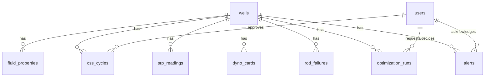

# 02 — Backend: API, Data & Model Layer

This document specifies the `backend/` FastAPI application completely. Build exactly what is written here.

---

## 1. Backend Goals

The backend owns: authentication/RBAC, all well/cycle/SRP/rod-failure data persistence, the reservoir thermal/viscosity model, the CSS optimizer, the dynamometer-card classifier, the SRP setpoint optimizer, rod-failure risk scoring, alerting, and report export. The frontend contains no business logic — every number shown in the UI is computed here and returned via the REST API.

---

## 2. Exact Technology Stack

- **Language/framework:** Python 3.11, FastAPI 0.11x, Uvicorn (ASGI server)
- **Database:** PostgreSQL 16 + TimescaleDB extension
- **ORM/migrations:** SQLAlchemy 2.x, Alembic
- **Auth:** `python-jose` (JWT), `passlib[bcrypt]` (password hashing)
- **Validation:** Pydantic v2 (native to FastAPI)
- **ML:** `scikit-learn`, `xgboost`, `numpy`, `scipy` (for the CSS optimizer's search)
- **Scheduler:** `APScheduler` (in-process background jobs)
- **Reporting:** `reportlab` (PDF), stdlib `csv`/`json`
- **Testing:** `pytest`, `httpx` (async test client), `pytest-asyncio`
- **Containerization:** Docker + Docker Compose

---

## 3. Project Structure

(See 01-overview.md §8 for the full tree; this file governs `backend/`.)

---

## 4. Database Design

TimescaleDB hypertables are used for the two genuinely high-frequency time-series tables (`srp_readings`, `dyno_cards`); all other tables are plain relational tables.

### Table: `users`
| Column | Type | Required | Default | Notes |
|---|---|---|---|---|
| id | UUID PK | yes | gen_random_uuid() | |
| email | TEXT | yes | — | unique |
| password_hash | TEXT | yes | — | bcrypt |
| full_name | TEXT | yes | — | |
| role | TEXT | yes | — | `'admin' \| 'reservoir_engineer' \| 'field_engineer' \| 'ops_manager'` |
| created_at | TIMESTAMPTZ | yes | now() | |
| is_active | BOOLEAN | yes | true | |

### Table: `wells`
| Column | Type | Required | Default | Notes |
|---|---|---|---|---|
| id | UUID PK | yes | gen_random_uuid() | |
| name | TEXT | yes | — | unique, e.g. "BGW-014" |
| field_name | TEXT | yes | 'Baghewala' | |
| reservoir_formation | TEXT | yes | 'Jodhpur Sandstone' | |
| api_gravity | REAL | yes | — | 17–19 typical, validated on insert |
| reservoir_temp_c | REAL | yes | — | 46–48 typical baseline |
| reservoir_pressure_kpa | REAL | no | NULL | |
| productivity_index | REAL | no | NULL | calibrated from history once available |
| status | TEXT | yes | 'active' | `'active' \| 'shut_in' \| 'workover'` |
| created_at | TIMESTAMPTZ | yes | now() | |

Unique constraint: `name`.

### Table: `fluid_properties`
| Column | Type | Required | Default | Notes |
|---|---|---|---|---|
| id | UUID PK | yes | gen_random_uuid() | |
| well_id | UUID FK → wells.id | yes | — | |
| measured_at | TIMESTAMPTZ | yes | — | |
| dead_oil_viscosity_cp | REAL | no | NULL | measured at a reference temp, if available |
| reference_temp_c | REAL | no | NULL | |
| asphaltene_pct | REAL | no | NULL | |
| source | TEXT | yes | — | `'lab' \| 'estimated'` |

### Table: `css_cycles`
| Column | Type | Required | Default | Notes |
|---|---|---|---|---|
| id | UUID PK | yes | gen_random_uuid() | |
| well_id | UUID FK → wells.id | yes | — | |
| cycle_number | INTEGER | yes | — | sequential per well |
| steam_volume_m3 | REAL | yes | — | |
| injection_pressure_kpa | REAL | yes | — | |
| steam_temp_c | REAL | yes | — | derived from pressure or entered directly |
| soak_time_hours | REAL | yes | — | |
| injection_start | TIMESTAMPTZ | yes | — | |
| injection_end | TIMESTAMPTZ | yes | — | |
| production_start | TIMESTAMPTZ | no | NULL | |
| production_cutoff | TIMESTAMPTZ | no | NULL | NULL while cycle ongoing |
| cumulative_oil_bbl | REAL | no | NULL | filled in as production data ingests |
| status | TEXT | yes | 'planned' | `'planned' \| 'injecting' \| 'soaking' \| 'producing' \| 'completed'` |
| is_ai_recommended | BOOLEAN | yes | false | true if parameters came from the CSS optimizer |
| approved_by | UUID FK → users.id | no | NULL | |
| approved_at | TIMESTAMPTZ | no | NULL | |

### Table: `srp_readings` (TimescaleDB hypertable, partitioned on `reading_time`)
| Column | Type | Required | Default | Notes |
|---|---|---|---|---|
| well_id | UUID FK → wells.id | yes | — | |
| reading_time | TIMESTAMPTZ | yes | — | hypertable partition key |
| spm | REAL | yes | — | strokes per minute |
| stroke_length_in | REAL | yes | — | |
| vfd_frequency_hz | REAL | no | NULL | |
| polished_rod_load_lbf | REAL | no | NULL | instantaneous, if available |
| motor_current_a | REAL | no | NULL | |
| estimated_fluid_level_m | REAL | no | NULL | |

Primary key: composite `(well_id, reading_time)` (TimescaleDB convention).

### Table: `dyno_cards` (TimescaleDB hypertable, partitioned on `card_time`)
| Column | Type | Required | Default | Notes |
|---|---|---|---|---|
| id | UUID PK | yes | gen_random_uuid() | |
| well_id | UUID FK → wells.id | yes | — | |
| card_time | TIMESTAMPTZ | yes | — | |
| load_position_json | TEXT | yes | — | serialized array of `{position_in, load_lbf}` points, one stroke cycle |
| pprl_lbf | REAL | yes | — | peak polished rod load, precomputed on ingest |
| mprl_lbf | REAL | yes | — | minimum polished rod load |
| card_area | REAL | yes | — | work done per stroke (computed on ingest) |
| classification | TEXT | no | NULL | filled by dyno_classifier: `'normal' \| 'fluid_pound' \| 'gas_interference' \| 'pump_off' \| 'worn_valve' \| 'uncertain'` |
| classification_confidence | REAL | no | NULL | |
| is_synthetic | BOOLEAN | yes | true | false once real historian data is ingested |

### Table: `rod_failures`
| Column | Type | Required | Default | Notes |
|---|---|---|---|---|
| id | UUID PK | yes | gen_random_uuid() | |
| well_id | UUID FK → wells.id | yes | — | |
| failure_time | TIMESTAMPTZ | yes | — | |
| failure_type | TEXT | yes | — | `'fatigue' \| 'buckling' \| 'coupling' \| 'other'` |
| depth_ft | REAL | no | NULL | |
| downtime_hours | REAL | no | NULL | |
| is_synthetic | BOOLEAN | yes | true | |

### Table: `optimization_runs`
| Column | Type | Required | Default | Notes |
|---|---|---|---|---|
| id | UUID PK | yes | gen_random_uuid() | |
| well_id | UUID FK → wells.id | yes | — | |
| run_type | TEXT | yes | — | `'css' \| 'srp'` |
| requested_by | UUID FK → users.id | yes | — | |
| requested_at | TIMESTAMPTZ | yes | now() | |
| input_params_json | TEXT | yes | — | |
| recommended_params_json | TEXT | yes | — | |
| predicted_metrics_json | TEXT | yes | — | e.g. predicted SOR, fillage |
| status | TEXT | yes | 'pending' | `'pending' \| 'approved' \| 'rejected'` |
| decided_by | UUID FK → users.id | no | NULL | |
| decided_at | TIMESTAMPTZ | no | NULL | |
| rejection_reason | TEXT | no | NULL | |

### Table: `alerts`
| Column | Type | Required | Default | Notes |
|---|---|---|---|---|
| id | UUID PK | yes | gen_random_uuid() | |
| well_id | UUID FK → wells.id | yes | — | |
| alert_type | TEXT | yes | — | `'fluid_pound' \| 'high_risk' \| 'sor_trending_up' \| 'pump_off'` |
| severity | TEXT | yes | — | `'info' \| 'warning' \| 'critical'` |
| message | TEXT | yes | — | |
| created_at | TIMESTAMPTZ | yes | now() | |
| acknowledged_by | UUID FK → users.id | no | NULL | |
| acknowledged_at | TIMESTAMPTZ | no | NULL | |



---

## 5. Database Rules

- **Referential integrity:** all FKs enforced; `wells.id` deletion is restricted (`ON DELETE RESTRICT`) — a well with history cannot be deleted, only set `status='shut_in'` (soft-decommission, not row deletion — this is the one place soft-delete-style status is used, because well history must be retained for the risk model).
- **Audit fields:** `created_at` on every table; `approved_by`/`approved_at`, `decided_by`/`decided_at`, `acknowledged_by`/`acknowledged_at` capture who made every consequential decision.
- **Timestamps:** all `TIMESTAMPTZ` (UTC), never naive local time.
- **Pagination:** all list endpoints (`GET /wells`, `GET /alerts`, etc.) support `?page=&page_size=` (default page_size=25, max 100), ordered by the most relevant time column descending.
- **Query conventions:** SQLAlchemy Core/ORM parameterized queries only; no raw string-formatted SQL.
- **Transactions:** any multi-table write (e.g., approving an `optimization_run` and updating the corresponding `css_cycles`/SRP setpoint state) wrapped in a single DB transaction.
- **Migration strategy:** Alembic autogenerate + manual review per PR; `alembic upgrade head` run automatically on container start in the Docker Compose demo setup.
- **Seed data:** `backend/app/ingestion/simulator.py` + a `seed.py` script populate demo wells and history on first run — see §14.

---

## 6. Authentication

- **Registration:** Admin-only — `POST /api/v1/admin/users` (no public self-signup; this is an internal operations tool, not a public product).
- **Login:** `POST /api/v1/auth/login` — body `{email, password}` → verifies bcrypt hash → returns `{access_token, refresh_token, token_type: "bearer"}`.
- **Logout:** client-side token discard; refresh token additionally invalidated server-side (`revoked_tokens` set, checked on refresh) — a full server-side revocation list.
- **Token strategy:** access token TTL 15 minutes, refresh token TTL 7 days. `POST /api/v1/auth/refresh` exchanges a valid refresh token for a new access token.
- **Password hashing:** bcrypt via `passlib`, cost factor 12.
- **Password reset:** Admin-triggered reset (`POST /api/v1/admin/users/{id}/reset-password` generates a temporary password) — no email-based self-service reset needed for this internal-tool scope.
- **OTP/email:** not implemented — out of scope for an internal operations tool with Admin-managed accounts.
- **Session expiry:** enforced via access-token TTL; refresh token revocation on explicit logout.
- **Role management:** `role` field on `users`, settable only by Admin via the Admin API.
- **Permission enforcement:** FastAPI dependency `require_role(*roles)` injected on every endpoint that needs it — checked server-side, never trusted from the frontend alone.

---

## 7. API Specification

Base path: `/api/v1`. All authenticated endpoints require `Authorization: Bearer <access_token>`.

### `POST /auth/login`
- **Auth:** none (this is the login endpoint)
- **Body:** `{"email": "string", "password": "string"}`
- **Success (200):** `{"access_token": "...", "refresh_token": "...", "token_type": "bearer", "role": "field_engineer"}`
- **Errors:** `401 {"code":"INVALID_CREDENTIALS","message":"Incorrect email or password"}`

### `GET /wells`
- **Auth:** any authenticated role
- **Query params:** `page`, `page_size`, `status` (optional filter)
- **Success (200):** `{"items":[{"id":"...","name":"BGW-014","status":"active","current_alert_level":"warning"}], "total": 42, "page":1,"page_size":25}`

### `GET /wells/{well_id}/state`
- **Purpose:** Returns the full Digital Twin State — the single most important read endpoint in the product.
- **Auth:** any authenticated role
- **Success (200):**
```json
{
  "well_id": "uuid",
  "computed_at": "2026-09-27T10:00:00Z",
  "reservoir": {
    "estimated_temp_c": 52.3,
    "days_since_last_steam": 14,
    "estimated_viscosity_cp": 1840.0,
    "forecast_confidence": "in_range"
  },
  "current_cycle": {"id": "uuid", "cycle_number": 7, "status": "producing"},
  "srp": {
    "latest_card_id": "uuid",
    "classification": "fluid_pound",
    "classification_confidence": 0.87,
    "estimated_fillage_pct": 61.0,
    "current_spm": 6.2
  },
  "rod_failure_risk": {"score": 0.71, "band": "high"},
  "pending_recommendations": [{"id": "uuid", "run_type": "srp", "status": "pending"}]
}
```
- **Errors:** `404 {"code":"WELL_NOT_FOUND"}`

### `POST /css/optimize/{well_id}`
- **Auth:** `reservoir_engineer`, `admin`
- **Body:**
```json
{
  "steam_volume_m3_range": [200, 400],
  "soak_time_hours_range": [48, 120],
  "min_recovery_bbl": 500
}
```
- **Behavior:** runs `css_optimizer.optimize()` (§8.3) over the calibrated per-well response model.
- **Success (200):** ranked list of candidates: `[{"steam_volume_m3":320,"soak_time_hours":72,"predicted_sor":2.8,"predicted_cumulative_oil_bbl":610,"predicted_srp_impact":{"est_viscosity_at_start_cp":2100,"recommended_initial_spm":4.5}}]`
- **Errors:** `422 {"code":"NO_FEASIBLE_CANDIDATE","message":"No parameter set within range meets min_recovery_bbl"}`; `400 {"code":"INSUFFICIENT_HISTORY","message":"Well has <3 historical cycles — using field-average calibration"}` (returned as a warning field alongside results, not a hard failure — see §8.2).

### `POST /css/cycles/{well_id}/plan`
- **Auth:** `reservoir_engineer`, `admin`
- **Body:** chosen candidate parameters (subset of the optimize response) + `is_ai_recommended: true`
- **Success (201):** created `css_cycles` row, `status='planned'`
- **Errors:** `400 {"code":"CYCLE_VALIDATION_FAILED", field, message}`

### `GET /srp/dyno-cards/{well_id}?limit=`
- **Auth:** any authenticated role
- **Success (200):** list of recent cards with classification + confidence.

### `POST /srp/optimize/{well_id}`
- **Auth:** `field_engineer`, `admin`
- **Body:** `{}` (uses latest ingested state — no manual params needed, unlike CSS which explores a range)
- **Behavior:** runs `srp_optimizer.recommend()` (§8.4).
- **Success (200):** `{"recommended_spm":4.8,"recommended_stroke_length_in":86,"predicted_fillage_pct":89.0,"rod_stress_check":"within_limit","optimization_run_id":"uuid"}`
- **Errors:** `422 {"code":"NO_SAFE_RECOMMENDATION","message":"Fillage target requires exceeding rod stress limit — flagged for mechanical review"}`

### `POST /optimization-runs/{run_id}/approve`
- **Auth:** role matching the run's domain (`reservoir_engineer` for `css`, `field_engineer` for `srp`; `admin` can approve either)
- **Success (200):** `{"status":"approved","decided_at":"..."}`
- **Errors:** `409 {"code":"ALREADY_DECIDED"}`

### `POST /optimization-runs/{run_id}/reject`
- **Body:** `{"reason": "optional free text"}`
- **Success (200):** `{"status":"rejected"}`

### `GET /alerts?severity=&acknowledged=`
- **Auth:** any authenticated role
- **Success (200):** paginated alert list.

### `POST /alerts/{alert_id}/acknowledge`
- **Auth:** any authenticated role
- **Success (200):** `{"acknowledged_at":"..."}`

### `POST /admin/ingestion/source`
- **Auth:** `admin`
- **Body:** `{"source_type": "simulator" | "csv_import", "csv_file": <multipart, if csv_import>}`
- **Behavior:** switches the active `IngestionSource`; for CSV, validates and imports the file through the identical `WellService.ingest_reading()` path used by the simulator (§9 of 01-overview.md, Journey 4).
- **Errors:** `400 {"code":"CSV_SCHEMA_INVALID", "row": N, "message": "..."}`

### `GET /reports/field-summary?format=pdf|csv|json&period_days=90`
- **Auth:** `ops_manager`, `admin`
- **Success (200):** file stream or JSON summary (SOR trend, energy/bbl trend, rod-failure count).

**Consistent error format (all endpoints):**
```json
{"code": "SNAKE_CASE_CODE", "message": "human-readable", "field": "optional"}
```

---

## 8. Business Logic

### 8.1 Reservoir Thermal Decay Model
```
FUNCTION estimated_temp(well, t_days_since_steam_end):
    T_res = well.reservoir_temp_c              # baseline, 46-48C typical
    T_steam = well.last_cycle.steam_temp_c
    tau = well.calibrated_tau_days             # fit per well from historical temp/production decline; field-average default if <3 cycles of history
    RETURN T_res + (T_steam - T_res) * exp(-t_days_since_steam_end / tau)
```

### 8.2 Viscosity Model (Beggs-Robinson dead-oil correlation)
```
FUNCTION dead_oil_viscosity_cp(api_gravity, temp_c):
    temp_f = temp_c * 9/5 + 32
    Y = 10 ** (3.0324 - 0.02023 * api_gravity)
    X = Y * (temp_f ** -1.163)
    mu_od = (10 ** X) - 1
    RETURN mu_od   # centipoise

FUNCTION estimated_viscosity(well, t_days_since_steam_end):
    temp = estimated_temp(well, t_days_since_steam_end)
    RETURN dead_oil_viscosity_cp(well.api_gravity, temp)
```
Calibration: if the well has ≥3 completed cycles with recorded production, `tau` is fit by least-squares regression of the observed oil-rate decline curve against the model above; below 3 cycles, a field-average `tau` (fit across all wells with sufficient history) is used, and the API response includes `"forecast_confidence": "field_default"` to make this explicit to the user (never silently presented as well-specific).

### 8.3 CSS Parameter Optimizer
```
FUNCTION optimize(well, steam_volume_range, soak_time_range, min_recovery_bbl):
    candidates = grid_or_bayesian_search(steam_volume_range, soak_time_range, n_samples=200)
    results = []
    FOR (steam_volume, soak_time) IN candidates:
        steam_temp = pressure_to_temp(well.calibrated_injection_pressure_for(steam_volume))
        simulated_production = simulate_cycle(well, steam_volume, steam_temp, soak_time)
        # simulate_cycle integrates estimated_viscosity(t) and the well's productivity_index
        # over the production period to forecast oil rate q(t) = PI * drawdown / viscosity(t),
        # cut off when q(t) falls below an economic threshold derived from min_recovery_bbl
        cumulative_oil = integrate(simulated_production.rate_curve)
        IF cumulative_oil < min_recovery_bbl:
            CONTINUE
        sor = steam_volume / cumulative_oil
        results.append({params, cumulative_oil, sor, predicted_srp_impact: srp_impact_at_cycle_start(well, steam_temp)})
    IF results IS EMPTY:
        RAISE NoFeasibleCandidateError
    RETURN sort_by(results, key=sor, ascending=True)[:5]   # top 5 lowest-SOR feasible candidates
```

### 8.4 Dynamometer Card Feature Extraction & Classification
```
FUNCTION extract_features(load_position_points):
    pprl = max(p.load FOR p IN load_position_points)
    mprl = min(p.load FOR p IN load_position_points)
    card_area = shoelace_polygon_area(load_position_points)   # standard closed-curve area formula
    downstroke_points = points_where(position decreasing)
    downstroke_derivative = diff(downstroke_points.load) / diff(downstroke_points.position)
    downstroke_spike = max(abs(downstroke_derivative)) - median(abs(downstroke_derivative))
    counterbalance_ratio = (pprl + mprl) / 2 / pprl
    RETURN FeatureVector(pprl, mprl, card_area, downstroke_spike, counterbalance_ratio)

FUNCTION classify(card):
    features = extract_features(card.load_position_points)
    probs = xgboost_model.predict_proba(features)   # trained in ml/train_dyno_classifier.py
    top_class, confidence = argmax(probs)
    IF confidence < CONFIDENCE_THRESHOLD (default 0.6):
        RETURN ('uncertain', confidence)
    RETURN (top_class, confidence)
```
Training data (`ml/synth_dyno_dataset.py`): synthetic card shapes generated per class using known petroleum-engineering card-shape signatures — Normal (smooth parallelogram-like loop), Fluid Pound (sharp downstroke collapse/spike), Gas Interference (compressed, reduced card area with a delayed load pickup), Pump-Off (card area collapses toward a thin sliver as the pump outruns fluid inflow), Worn Valve (rounded corners, reduced peak load) — each parameterized with realistic noise, so the classifier learns the actual diagnostic shapes rather than an arbitrary label.

### 8.5 SRP Setpoint Optimizer (fillage-based control + rod stress limit)
```
FUNCTION recommend(well_state):
    fillage = estimate_fillage(well_state.latest_card)      # from card_area / theoretical max area at current stroke length
    current_spm = well_state.srp.current_spm

    IF well_state.srp.classification == 'fluid_pound':
        candidate_spm = current_spm * REDUCTION_FACTOR (default 0.75)
    ELSE IF well_state.srp.classification == 'pump_off':
        candidate_spm = current_spm * REDUCTION_FACTOR_AGGRESSIVE (default 0.6)
    ELSE IF fillage < TARGET_FILLAGE_MIN (default 80%):
        candidate_spm = current_spm * 0.9
    ELSE IF fillage > TARGET_FILLAGE_MAX (default 95%) AND classification == 'normal':
        candidate_spm = min(current_spm * 1.1, well.vfd_max_spm)   # room to increase production
    ELSE:
        candidate_spm = current_spm   # no change needed

    predicted_stress = rod_string_stress(well, candidate_spm, well_state.srp.stroke_length_in)
    IF predicted_stress > well.rod_string.api_11l_allowable_stress:
        RAISE NoSafeRecommendationError("Fillage target requires exceeding rod stress limit")

    predicted_fillage = estimate_fillage_at_spm(well_state, candidate_spm)
    RETURN {recommended_spm: candidate_spm, predicted_fillage_pct: predicted_fillage, rod_stress_check: "within_limit"}

FUNCTION rod_string_stress(well, spm, stroke_length):
    # API RP 11L-style approximation: peak stress ~ function of PPRL, rod cross-sectional area,
    # and a dynamic factor increasing with SPM (higher SPM = higher acceleration loads on the rod string)
    dynamic_factor = 1 + K_DYNAMIC * (spm / well.rod_string.natural_frequency_spm) ** 2
    stress = (well_state.srp.pprl_lbf * dynamic_factor) / well.rod_string.cross_sectional_area_in2
    RETURN stress   # psi, compared against the rod grade's allowable stress from API RP 11L tables
```

### 8.6 Rod-Failure Risk Score
```
FUNCTION risk_score(well):
    stress_exposure = cumulative_stress_cycles(well) / rod_fatigue_limit(well.rod_string.grade)   # Goodman-diagram-informed normalization
    fluid_pound_frequency = count(dyno_cards WHERE well_id=well.id AND classification='fluid_pound' AND card_time > now()-90d) / 90
    base_rate = well.rod_failures_last_2yr / 24    # per-month base rate, field-average if well has no history
    score = clamp(W1*stress_exposure + W2*fluid_pound_frequency + W3*base_rate, 0, 1)   # weights tuned/documented in Technical Report
    band = 'high' if score > 0.66 else 'medium' if score > 0.33 else 'low'
    RETURN (score, band)
```

---

## 9. Error Handling

| Error Code | Status | User-safe message | Retry |
|---|---|---|---|
| INVALID_CREDENTIALS | 401 | "Incorrect email or password." | none |
| WELL_NOT_FOUND | 404 | "Well not found." | none |
| CYCLE_VALIDATION_FAILED | 400 | "Cycle parameter '<field>' is invalid." | user fixes and resubmits |
| NO_FEASIBLE_CANDIDATE | 422 | "No parameter combination in range meets the minimum recovery target." | user widens range |
| INSUFFICIENT_HISTORY | 200 (warning field, not hard error) | "Using field-average calibration — this well has limited history." | N/A |
| NO_SAFE_RECOMMENDATION | 422 | "Recommended fillage target would exceed rod stress limits — flagged for mechanical review." | none — requires engineering review, not a retry |
| CSV_SCHEMA_INVALID | 400 | "Row <N> in the uploaded file does not match the expected format." | user fixes file and re-uploads |
| ALREADY_DECIDED | 409 | "This recommendation has already been approved/rejected." | none |
| DB_WRITE_FAILED | 500 | "Could not save data — please retry." | automatic retry once after 200ms |

All errors logged server-side (structured JSON logs) with full context; only the safe `message` field is ever returned to the client.

---

## 10. Background Jobs

| Job | Trigger | Payload | Processing | Retry | Idempotency |
|---|---|---|---|---|---|
| Simulator tick | APScheduler interval (default every 10s = 1 simulated hour) | none | generates next synthetic readings for all active wells, writes via `WellService.ingest_reading()` | logged and skipped on failure, next tick proceeds | each tick is independently applied |
| Digital Twin State recompute | debounced on new data per well (max once per 30s per well) | well_id | runs reservoir model + latest classification + risk score, updates cache | retried once on transient DB error | idempotent — recompute is a pure function of current data |
| Alert evaluation | after each state recompute | well_id, new state | checks thresholds (classification != normal, risk score band change, SOR trend) → creates `alerts` row if newly triggered (no duplicate alert if one is already open & unacknowledged for the same condition) | N/A | de-duplicated by open-alert check |
| Report generation | `GET /reports/field-summary` request | period_days | aggregates and renders PDF/CSV | on failure, returns 500 with retry-safe message | re-generation is deterministic given the same period |

---

## 11. AI/ML Backend

- **Provider:** none external — local `xgboost` model, loaded once at startup from `ml/models/dyno_classifier.xgb`.
- **Training:** offline, `ml/train_dyno_classifier.py`, run before packaging; not part of the runtime API.
- **Request format:** `FeatureVector` (5 floats, §8.4).
- **Response schema:** `{class: str, confidence: float, probabilities: dict}`.
- **Validation:** stratified 70/15/15 split; per-class precision/recall/F1 and confusion matrix checked into `docs/technical_report/` as a generated artifact (script re-runnable, not a static claim).
- **Retry/timeout:** synchronous, sub-millisecond — no timeout handling needed.
- **Fallback:** if the model file fails to load at startup, the API logs a `MODEL_LOAD_FAILED` warning and `classify()` always returns `('uncertain', 0.0)` — the rest of the system (fillage estimate, rod stress check) continues to function without the classifier.
- **Caching:** none needed given inference cost.
- **Cost control:** N/A (local compute only).

---

## 12. Security Implementation

- **JWT/session security:** HS256 signing with a secret from environment variable `JWT_SECRET` (min 32 random bytes, generated at deploy time, never committed); short-lived access tokens minimize exposure window.
- **RBAC:** `require_role()` FastAPI dependency on every state-changing endpoint and every domain-restricted read (e.g., CSS optimizer restricted from `field_engineer` role, mirroring real organizational boundaries).
- **CORS:** `CORSMiddleware` allowlist restricted to the known frontend origin(s) only.
- **CSRF:** not applicable (JWT bearer-token API, not cookie-session-based, so classic CSRF does not apply — documented explicitly to preempt a judge's generic security-checklist question).
- **Rate limiting:** `slowapi` (Redis-free, in-memory) limiter on `/auth/login` (e.g., 10 attempts/minute/IP).
- **Input sanitization:** Pydantic schema validation on every endpoint; physical-range checks on ingestion payloads (§10 of 01-overview.md).
- **SQL injection prevention:** SQLAlchemy parameterized queries exclusively.
- **File validation (CSV import):** MIME-type and size-limit checked before parsing; parsed with `pandas.read_csv` inside a strict schema validator, never `eval`'d or executed.
- **Secrets:** `.env` file (gitignored) for `JWT_SECRET`, `DATABASE_URL`; `.env.example` checked in with placeholders.
- **Logging/PII:** only `users.email`/`full_name` are quasi-personal, and both are operational work accounts, not general personal data; no PII beyond this exists in the system.

---

## 13. Testing

### Unit tests
- `test_reservoir_model.py`: `dead_oil_viscosity_cp()` matches known Beggs-Robinson reference values for given API/temp pairs; `estimated_temp()` decays correctly toward `T_res` as `t → ∞`.
- `test_css_optimizer.py`: returns only candidates meeting `min_recovery_bbl`; raises `NoFeasibleCandidateError` when none qualify; results sorted ascending by SOR.
- `test_dyno_features.py`: `extract_features()` produces correct PPRL/MPRL/area on hand-constructed synthetic cards with known values.
- `test_srp_optimizer.py`: never recommends an SPM whose predicted stress exceeds the rod's allowable limit (property-based test across randomized well/rod parameters); reduces SPM on `fluid_pound`/`pump_off` classifications.
- `test_risk_score.py`: score is monotonically non-decreasing as fluid-pound frequency or stress exposure increases, holding other inputs fixed.

### Integration/API tests (`httpx` async client against a test DB)
- `test_auth_flow.py`: login → access protected endpoint → 401 without token → 403 with wrong role.
- `test_css_flow.py`: `POST /css/optimize` → `POST /css/cycles/plan` → row created with `status='planned'`.
- `test_srp_flow.py`: ingest a synthetic fluid-pound card → `GET /wells/{id}/state` reflects the classification → `POST /srp/optimize` returns a reduced SPM → approve → `optimization_runs.status='approved'`.
- `test_csv_import.py`: valid CSV import populates identical downstream state to the simulator path (the concrete test proving the `IngestionSource` abstraction); malformed CSV row returns `CSV_SCHEMA_INVALID` with the correct row number.
- `test_rbac.py`: each role-restricted endpoint rejects the wrong role with 403 and accepts the correct role with 200/201.

### Concrete test checklist (must pass before Phase 5)
- [ ] Every P0 API endpoint has at least one integration test.
- [ ] Dyno classifier F1 ≥ 0.85 on the held-out synthetic test set for `fluid_pound` and `pump_off` classes specifically (the safety-relevant classes).
- [ ] SRP optimizer never proposes a stress-limit-violating SPM across 1,000 randomized property-based test cases.
- [ ] CSV import and simulator ingestion produce identical `GET /wells/{id}/state` shape (schema, not values) for equivalent input.
- [ ] Full Docker Compose stack (`docker compose up`) reaches a healthy `/health` response within 30s on a clean machine.

---

## 14. Seed/Demo Data

`backend/app/ingestion/simulator.py` + `seed.py` create, on first launch:
- **6 demo wells** (BGW-001 through BGW-006), API gravity randomized within 17–19, reservoir temp within 46–48°C.
- **BGW-003** pre-seeded with a fluid-pound dynamometer card pattern and an elevated (`high` band) rod-failure risk score — the well used in the demo script (01-overview.md §12).
- **BGW-005** pre-seeded with ≥5 completed historical CSS cycles (enabling a well-specific, non-field-default calibration to be shown live).
- One bundled sample historian-format CSV (`backend/tests/fixtures/sample_historian_export.csv`) matching the `srp_readings`/`dyno_cards` ingestion schema, clearly documented in the User Manual as a self-constructed stand-in for a real OIL historian export, not an official OIL data asset.

---

## 15. Deployment

**Environment variables** (`.env`):
```
DATABASE_URL=postgresql://wellsync:wellsync@db:5432/wellsync
JWT_SECRET=<32+ random bytes, generated at deploy time>
JWT_ACCESS_TTL_MIN=15
JWT_REFRESH_TTL_DAYS=7
SIMULATOR_TICK_SECONDS=10
```

**Local/demo deployment (Docker Compose):**
```bash
docker compose up --build
# services: db (postgres+timescaledb image), backend (uvicorn), frontend (vite preview or nginx-served build)
```

**Database setup:**
```bash
docker compose exec backend alembic upgrade head
docker compose exec backend python seed.py
```

**Build commands:**
```bash
# backend
pip install -r backend/requirements.txt
# frontend
cd frontend && npm install && npm run build
```

**Start commands (development):**
```bash
uvicorn app.main:app --reload --port 8000       # backend
npm run dev                                      # frontend
```

**Migration commands:** `alembic revision --autogenerate -m "..."` then `alembic upgrade head`.

**Health checks:** `GET /health` returns `{"db":"ok","simulator":"running","model_loaded":true}` — polled by the frontend for a visible system-status indicator, and used as the Docker Compose `healthcheck` for the backend service.

**Logs:** structured JSON logs to stdout (captured by `docker compose logs`), plus a rotating file handler (`logs/backend_<date>.log`) for post-demo review.

**Rollback strategy:** tagged Docker images per milestone; `docker compose down && docker compose up <previous-tag>` as the demo-day fallback if a last-minute change misbehaves.
